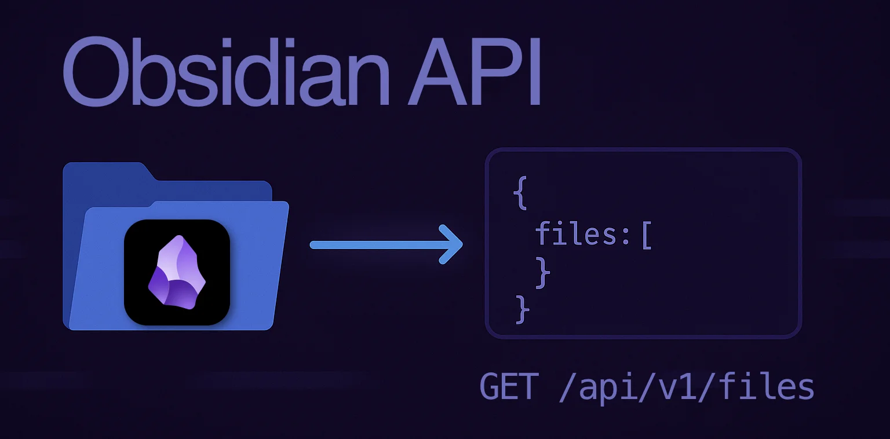

# Obsidian API

A personal RESTful API for managing markdown files and folders in your [Obsidian](https://obsidian.md/) vault.

Built with:
- [FastAPI](https://github.com/FastAPI/FastAPI) for the web framework
- [Pydantic](https://github.com/pydantic/pydantic) for data validation
- [Uvicorn](https://github.com/encode/uvicorn) for the ASGI server
- [Pytest](https://github.com/pytest-dev/pytest) for testing
- [UV](https://github.com/astral-sh/uv) for package management

> ⚠️ **Warning**: This is an experimental API for personal use on a local network. It is not secured and should not be exposed to the internet or used in production environments.

## Setup

### Local Environment

1. Set your Obsidian vault path:
```bash
export OBSIDIAN_API_VAULT_PATH="/path/to/your/obsidian/vault"
```

2. Start the server:
```bash
uv run uvicorn app.main:app --reload
```

The API will be available at `http://localhost:8000` with interactive documentation at `http://localhost:8000/docs`.

### Docker Environment

1. Create a `.env` file in the project root with your Obsidian vault path:
```bash
OBSIDIAN_VAULT_PATH="/path/to/your/obsidian/vault"
```

2. Build and start the container:
```bash
docker compose up --build
```

The API will be available at:
- `http://localhost:8000` (from your machine)
- `http://<your-ip-address>:8000` (from other devices on your network)
- `http://obsidian-api:8000` (from other containers in the same Docker network)

Note: The container mounts your Obsidian vault as a volume at `/mnt/vault` inside the container.

## API Endpoints

### Files
- `GET /files` - List all markdown files
- `GET /files/{path}` - Read the contents of a specific file
- `POST /files/{path}` - Create a new file
- `PATCH /files/{path}` - Move/Rename a file
- `PUT /files{path}` - Update the contents of an existing file

### Folders
- `GET /folders` - List all folders
- `GET /folders/{path}` - List files in a specific folder
- `POST /folders/{path}` - Create a new folder
- `PATCH /folders/{path}` - Move/Rename a folder

For detailed API documentation, including request/response schemas and examples, visit the Swagger UI at `http://localhost:8000/docs`.

## Testing

Run tests (a few different styles for reference):
```bash
uv run pytest 
uv run pytest tests/test_routes.py
uv run pytest tests/test_routes.py::test_move_file
```
Use the  `-v` flag to provide more detailed output.

## Reason for Creating

This project began as an educational endeavor, but it's also something I'm actively using in a local, practical context. While the API is already valuable for some of my personal automations, it's part of a broader experiment: building a personal, local AI agent. One key capability of this agent is integrating with my Obsidian knowledge base in a way that supports interoperability with other tools.

Creating a file system API to interact directly with Obsidian's raw data is just the first step. Although the Obsidian Copilot plugin is impressive, its vector store is locked within the plugin itself. I considered contributing to that project, but ultimately chose to build something of my own to retain the flexibility to explore and experiment more freely.

Future Plans:
- Make deployable in a local Docker services.
- Provide and authentication mechanism.
- Implement a MCP server for the API.
- Add additional endpoints like DELETE and perhaps MERGE. But I'd want configuration or authorization to be in plact to control access.
- Provide file/folder metadata. Perhaps integrating file frontmatter into metadata.

